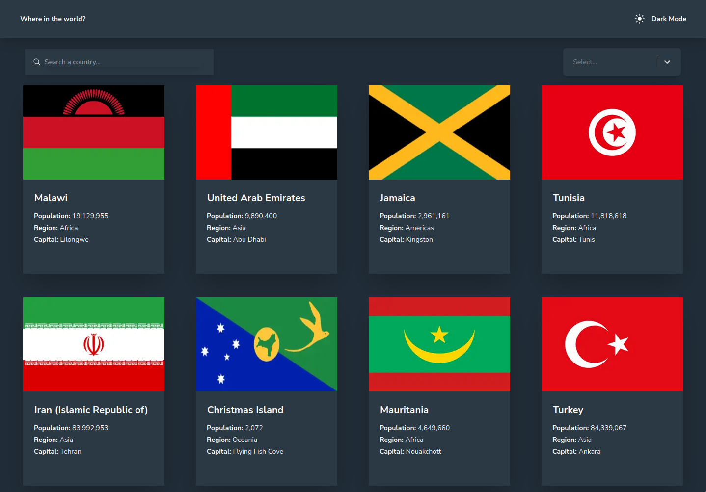

# Frontend Mentor - REST Countries API with color theme switcher solution

This is a solution to the [REST Countries API with color theme switcher challenge on Frontend Mentor](https://www.frontendmentor.io/challenges/rest-countries-api-with-color-theme-switcher-5cacc469fec04111f7b848ca). Frontend Mentor challenges help you improve your coding skills by building realistic projects.

## Table of contents

- [Overview](#overview)
  - [The challenge](#the-challenge)
  - [Screenshot](#screenshot)
  - [Links](#links)
- [My process](#my-process)
  - [Built with](#built-with)
  - [What I learned](#what-i-learned)
  - [Continued development](#continued-development)
  - [Useful resources](#useful-resources)
- [Author](#author)
- [Acknowledgments](#acknowledgments)

**Note: Delete this note and update the table of contents based on what sections you keep.**

## Overview

### The challenge

Users should be able to:

- See all countries from the API on the homepage
- Search for a country using an `input` field
- Filter countries by region
- Click on a country to see more detailed information on a separate page
- Click through to the border countries on the detail page
- Toggle the color scheme between light and dark mode _(optional)_

### Screenshot



### Links

- Solution URL: [Add solution URL here](https://your-solution-url.com)
- Live Site URL: [Add live site URL here](https://your-live-site-url.com)

## My process

### Built with

- [Next.js-Theme] (https://www.npmjs.com/package/@wits/next-themes) - Theme APi for Next.js
- [Jotai](https://www.npmjs.com/package/jotai) - Context API library
- [React](https://reactjs.org/) - JS library
- [Next.js](https://nextjs.org/) - React framework
- [Tailwind](https://tailwindcss.com/) - For styles

### What I learned

I still have issues with the theme API...
Something changed since I wrote the Calculator frontend as at that time there was not error.
It would be very nice the have a complete understanding about this problem.

```js
"use client";
import { ThemeProvider } from "@wits/next-themes";
const Providers = ({ children }) => {
  return <ThemeProvider>{children}</ThemeProvider>;
};
export default Providers;
```

### Continued development

Dominate once and for all the use of themes with Next.js 13.

### Useful resources

- [useForms](https://www.youtube.com/watch?v=EbFW3u44xiY) - Very good tutorial about useForms.
- [Jotai](https://www.youtube.com/watch?v=ZcKzPZN7Ids) - Jotai package that offers a simplified context API

## Author

- Website - [Thomas Tschoepke Soares](https://www.linkedin.com/in/thomas-soares-6791781b/)
- Frontend Mentor - [@ttsoares](https://www.frontendmentor.io/profile/ttsoares)

## Acknowledgments

Several nice people helping students with Youtube videos...
